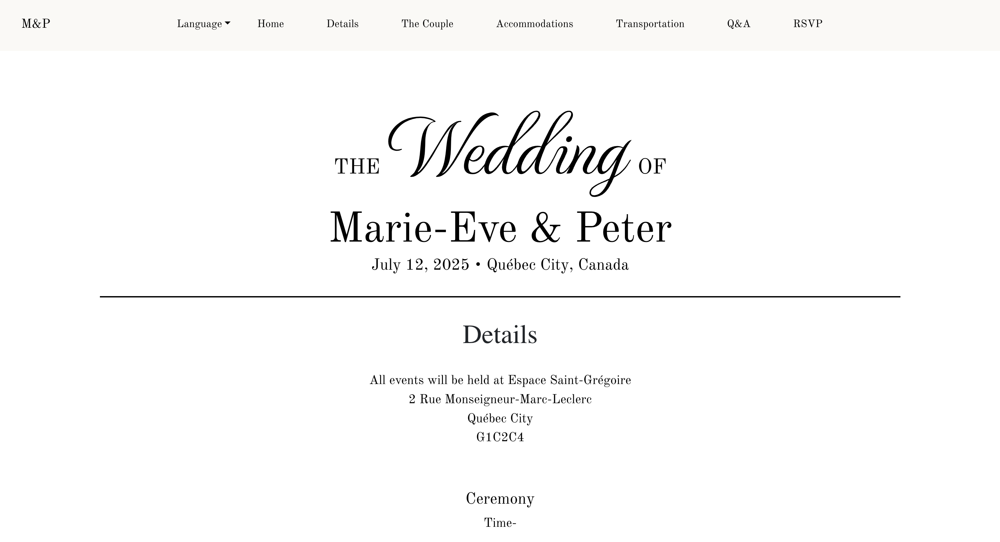
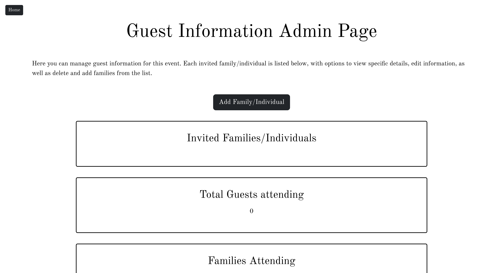
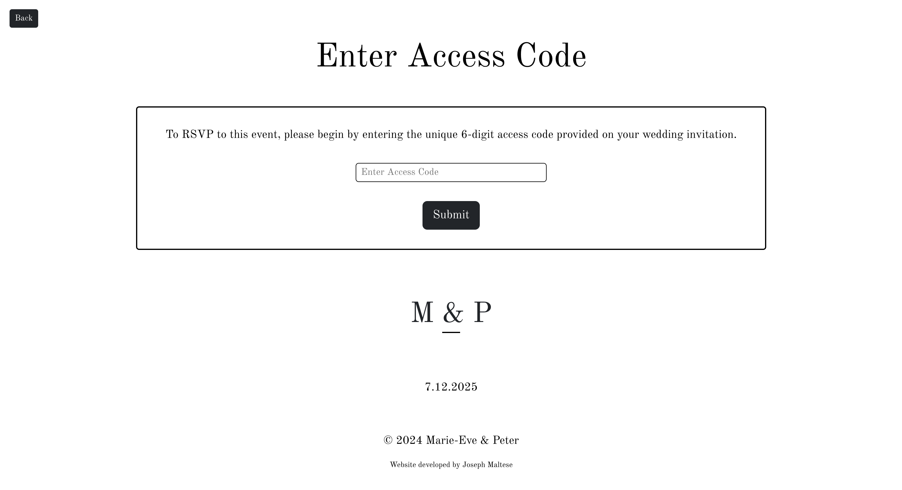

This is a project I created for my brother's upcoming wedding using the MERN stack. This web application allows guests to easily RSVP to the wedding virtually using the unique 6-character 
code given on their wedding invitation. An admin page exists for the couple to easily add/remove families from the system, and monitor who has RSVP'd to the event, as well as other important
metrics regarding attendance.

